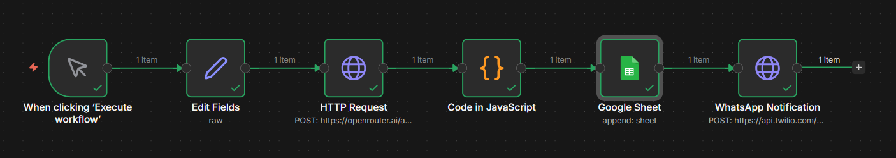
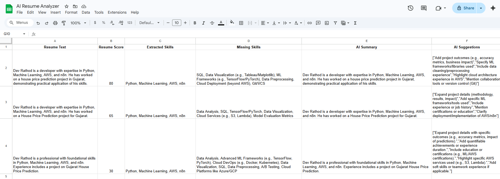

# 🤖 AI Resume Analyzer using n8n

🚀 An AI-powered automation tool that analyzes resumes and provides insights like score, skills, and improvement suggestions.

---

## 🔥 Features

* 📄 Resume analysis using AI
* 🧠 Extracts skills automatically
* ⚠️ Identifies missing skills
* 📊 Gives resume score
* 💡 Provides improvement suggestions
* 📲 Sends result via WhatsApp (Twilio)

---

## ⚙️ Tech Stack

* **n8n** (Automation)
* **OpenRouter API** (LLM)
* **Twilio API** (WhatsApp messaging)
* **JavaScript (n8n Code Node)**

---

## 🧩 Workflow

```text
Input Resume → AI Analysis → Format Output → WhatsApp Message
```

---

## 📸 Workflow Screenshot



---

## 🔐 Environment Variables

> ⚠️ Do NOT hardcode secrets. Use credentials in n8n.

* OPENROUTER_API_KEY
* TWILIO_ACCOUNT_SID
* TWILIO_AUTH_TOKEN

---

## 🧠 Example Output

```
Resume Score: 78/100

Skills:
- Python
- Machine Learning
- AWS

Missing Skills:
- Docker
- System Design

Suggestions:
- Add measurable achievements
- Improve project descriptions
```

---

## 🚀 How to Run

1. Import `workflow.json` into n8n
2. Add credentials:

   * OpenRouter API Key
   * Twilio SID & Token
3. Run workflow
4. Get result via WhatsApp

---

## 💡 Future Improvements

* Upload PDF resume directly
* Add Job Description matching
* Build UI with Streamlit

---

## 🏆 Author

Dev Rathod
AI + Automation Enthusiast 🚀
